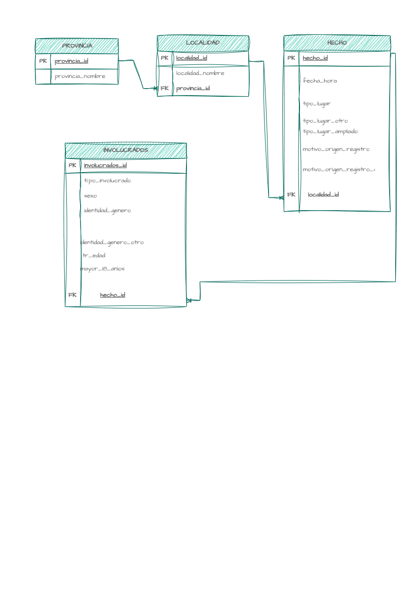

# Análisis de homicidios en Argentina desde 2017 - 2023

En este proyecto se busca responder a las siguientes interrogantes:

1. ¿Cuáles son las tres provincias con mayor cantidad de homicidios?
   
    a) De esas provincias, ¿cuál es su localidad más crítica?

#### A nivel nacional
  
2. Cuál es el grupo demográfico más vulnerable (sexo, género, edad)
3. ¿Existen meses o rangos horarios donde los casos se disparan?
4. ¿Los hechos suceden en el domicilio de la víctima o fuera del mismo?
5. ¿Cuál es el grupo demográfico más propenso a perpetuar el hecho delictivo (sexo, género, edad)?
6. ¿Cuál es el TOP 10 de localidades dónde sucede una mayor cantidad de femicidios?

## ETL

Se extraen los datos de https://datos.gob.ar/ 

link: https://datos.gob.ar/dataset/seguridad-homicidios-dolosos-sistema-alerta-temprana-estadisticas-criminales-republica-argentina/archivo/seguridad_6.2

El proceso de ETL y limpieza inicial se realiza con Python.

### Tecnologías:
- Pandas

## Diagrama de Entidad-Relación (DER)
Previo al análisis con PostgreSQL se plantea el siguiente diagrama Entidad-Relación para poder estructurar los datos de la mejor manera posible:

## Estructura de Datos (Tablas)
Luego del proceso de ETL, se divide el dataset original en 4 archivos CSV normalizados para su ingesta en la base de datos:

- `provincia.csv`
- `localidad.csv`
- `hecho.csv`
- `involucrados.csv`

### Normalización de Datos (Melt)
Para alinear los datos exactamente con el Diagrama Entidad-Relación, se aplicó una transformación (Melt) sobre la tabla `involucrados`. Se separó a las víctimas y a los inculpados en filas individuales, agregando la columna `tipo_involucrado` y asignando un ID único autoincremental en preparación para SQL.

## Base de Datos y Análisis
El análisis de los datos y la resolución de las interrogantes se realizará utilizando **PostgreSQL**.
  
